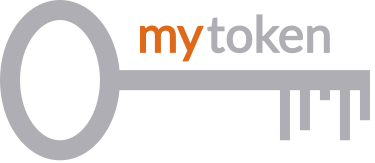

<!--  -->

# mytoken

`Mytoken` is a web service to obtain OpenID Connect Access Tokens in an easy but secure way for extended periods of time
and across multiple devices. In particular, `mytoken` was developed to provide OIDC Access Tokens to long-running
compute jobs.

Access Tokens can be obtained via so-called **`mytokens`**: A new token type that can be easily used as a Bearer token
from any device. These `mytokens` can be restricted according to the particular use case to only allow the needed
privileges.

`Mytoken` focuses on integration with the command line through our
[command line client](https://github.com/oidc-mytoken/client)
<!-- and [oidc-agent](https://github.com/indigo-dc/oidc-agent) -->
but also offers a web interface. A demo instance is available
at  [https://mytoken.data.kit.edu/](https://mytoken.data.kit.edu/).
`Mytoken` is a central web service with the goal to easily obtain OpenID Connect access tokens across devices.

Documentation is available at [https://mytoken-docs.data.kit.edu/](https://mytoken-docs.data.kit.edu/).

A go library for interacting with the mytoken server can be found
at [https://github.com/oidc-mytoken/lib](https://github.com/oidc-mytoken/lib).
